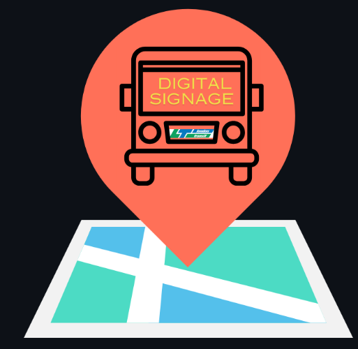

# Transit_Signage

 A Digital Signage System Leveraging London [LTC Transit Data](https://www.londontransit.ca/open-data/)

## Project Overview

This app is designed to provide bus riders with quick and easily accessible real-time information on arrival times, 
delays, and disruptions, eliminating the need for internet access on their phones. It is a visual tool that enhances 
commuters' planning by offering up-to-date bus data. Utilizing LTC datasets, the app extracts and displays dynamic 
transit information, including bus tracking, accessibility options, and additional features.

## Project members
* Bkkourh Oby
* Irmene-Valerie Leonard 
* Nguyen Albert An
* Sarkar Aaron 
* Yuan Jiaqi 

## Development environment 

* **IDE**
  * The project involves creating a C++ application, and we use Visual Studio 2022to develop it. 

* **Library**

  * [Wt 4.9.1](https://www.webtoolkit.eu/wt): Used to develop the application Web UI.

  * [libcurl 7.88](https://curl.se/libcurl/): Used to fetch the data on LTC and UWO websites.
    
  * [nlohmann/json.hpp](https://github.com/nlohmann/json): Used to parse JSON files.
  
  * [gumbo-query](https://github.com/lazytiger/gumbo-query): Used to parse HTML5 pages.

* **Documentation**
  * To generate API documentation in HTML format use used [Doxygen](https://www.doxygen.nl/).

## Project Management
*Confluence* : for project Documenation (UML class diagram)

*Jira* : to track the project progress trough User Stories with their acceptance tests.

*BitBucket* : to manage and store the project code


## Run the application
1. To directly run the application, please ensure that all the libraries are properly installed on a Linux System. Our tests we run a Ubuntu 22.04.
   For assistance for their installation, you can use this [guide](https://github.com/valerielnd/Transit_Signage/blob/main/Project_Signage/Library_Installation.txt)

2. Use the makefile in the [SignageSystem folder](https://github.com/valerielnd/Transit_Signage/tree/main/Project_Signage/signageSystem) to run and compile the project:
   
   ```
   make
   ```

3. To access the page for the bus stop natural science, please use the following link:

   - On the same computer : http://127.0.0.1:9091/natsci
   - On another computer : http://*IP*:9091/natsci


## Images of the Signage


 

